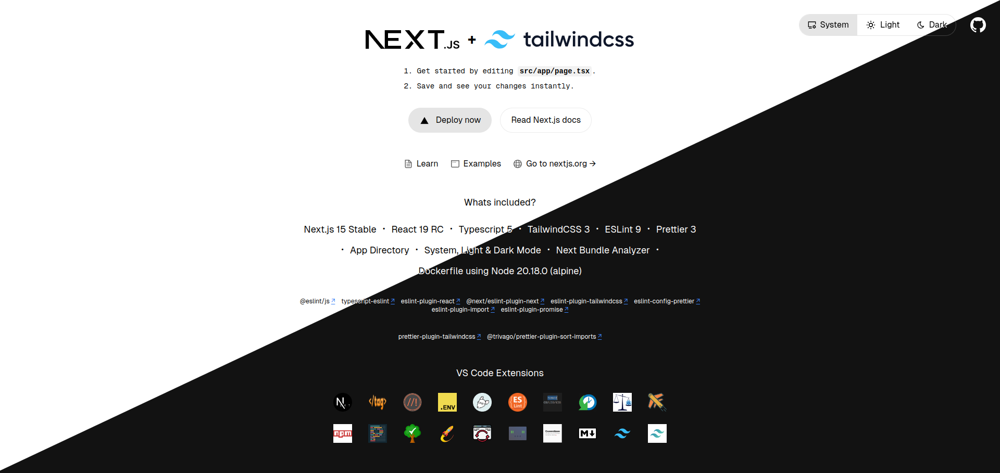

# Next.js 15 Boilerplate (tailwind) 

 [](https://typescriptlang.org)    [](https://saythanks.io/to/siddharthamaity)

Welcome to the **Next.js 15 Boilerplate** repository! This starter template is built with Next.js 15, React 19, TypeScript 5, Tailwind CSS 4 and comes packed with several powerful tools and configurations to accelerate your project setup and streamline development workflows using VS Code.



## 🚀 What's Included

- **Next.js 15**
- **React 19**
- **Javascript/TypeScript 5**
- **ESLint 9**
- **Redux 9**
- **Prettier 3**
- **Tailwind CSS 4**
- **JS-Cookie for Session Management**
- **Next Intl for Locale Translations**
- **React Icons & Lucide React**
- **React Email, Nodemailer & Resend**
- **App Directory**
- **Web3.js Create Account, Account Balance & Transactions**
- **Stripe Online Payments**
- **Google Maps (Places)**
- **React Turnstile (Cloudflare)
- **Firebase & Vercel, ready for fast deployment**
- **Firebase Realtime Database & Vercel Redis, ready for data storage**
- **Firebase Hosting & Vercel Blob, ready for file storage**
- **JWT Tokens & Data encryption**
- **GDPR Cookie Consent**
- **React Use Cart for Online Store**
- **System, Light & Dark Mode**
- **Next.js Bundle Analyzer**
- **Dockerfile** with Node.js 22.18.0 (Alpine)
- **Dockerfile.bun** with Bun 1.2.20 (Alpine)

### 🛠️ ESLint Plugins

- [**@eslint/js**](https://www.npmjs.com/package/@eslint/js)
- [**typescript-eslint**](https://github.com/typescript-eslint/typescript-eslint)
- [**eslint-plugin-react**](https://github.com/jsx-eslint/eslint-plugin-react)
- [**@next/eslint-plugin-next**](https://github.com/vercel/next.js)
- [**eslint-config-prettier**](eslint-config-prettier)
- [**eslint-plugin-tailwindcss**](https://github.com/francoismassart/eslint-plugin-tailwindcss)
- [**eslint-plugin-import**](https://github.com/import-js/eslint-plugin-import)
- [**eslint-plugin-promise**](https://github.com/eslint-community/eslint-plugin-promise)

### ✨ Prettier Plugins

- [**@trivago/prettier-plugin-sort-imports**](https://github.com/trivago/prettier-plugin-sort-imports)
- [**prettier-plugin-tailwindcss**](https://github.com/tailwindlabs/prettier-plugin-tailwindcss)

### 💻 VS Code Extensions (Recommended)

To enhance development experience, install the following VS Code extensions:

- [**Auto Close Tag**](https://marketplace.visualstudio.com/items?itemName=formulahendry.auto-close-tag)
- [**Better Comments**](https://marketplace.visualstudio.com/items?itemName=aaron-bond.better-comments)
- [**DotENV**](https://marketplace.visualstudio.com/items?itemName=mikestead.dotenv)
- [**EditorConfig for VS Code**](https://marketplace.visualstudio.com/items?itemName=EditorConfig.EditorConfig)
- [**ESLint**](https://marketplace.visualstudio.com/items?itemName=dbaeumer.vscode-eslint)
- [**formate: CSS/LESS/SCSS formatter**](https://marketplace.visualstudio.com/items?itemName=MikeBovenlander.formate)
- [**Git History**](https://marketplace.visualstudio.com/items?itemName=donjayamanne.githistory)
- [**Import Cost**](https://marketplace.visualstudio.com/items?itemName=wix.vscode-import-cost)
- [**JavaScript Booster**](https://marketplace.visualstudio.com/items?itemName=sburg.vscode-javascript-booster)
- [**npm Intellisense**](https://marketplace.visualstudio.com/items?itemName=christian-kohler.npm-intellisense)
- [**Prettier - Code formatter**](https://marketplace.visualstudio.com/items?itemName=esbenp)
- [**Todo Tree**](https://marketplace.visualstudio.com/items?itemName=Gruntfuggly.todo-tree)
- [**Turbo Console Log**](https://marketplace.visualstudio.com/items?itemName=ChakrounAnas.turbo-console-log)
- [**Package Json Upgrade**](https://marketplace.visualstudio.com/items?itemName=codeandstuff.package-json-upgrade)
- [**Visual Studio Code Commitizen Support**](https://marketplace.visualstudio.com/items?itemName=KnisterPeter.vscode-commitizen)
- [**Markdown All in One**](https://marketplace.visualstudio.com/items?itemName=yzhang.markdown-all-in-one)


## 🏁 Getting Started

### Prerequisites

- **Bun**: Version 1.2.20 or higher OR
- **Node.js**: Version 20.18.0 or higher
- **Docker**: For containerized deployment (optional but recommended)

### Installation

1. **Clone the Repository**:
    ```bash
    git clone https://github.com/asilvafx/nextjs-boilerplate.git
    cd nextjs-boilerplate
    ```

2. **Install Dependencies**:
    ```bash
    npm install
    # or with Yarn
    yarn install
    # or with pnpm
    pnpm install
    # or with Bun
    bun install
    ```

3. **Run Development Server**:
    ```bash
    npm run dev
    # or with Yarn
    yarn dev
    # or with pnpm
    pnpm dev
    # or with Bun
    bun dev
    ```

4. **Build for Production**:
    ```bash
    npm run build
    # or with Yarn
    yarn build
    # or with pnpm
    pnpm build
    # or with Bun
    bun run build
    ```

### 🐳 Docker Setup

To use Docker, make sure Docker is installed on your machine. Then, build and run the Docker container:

```bash
docker build . -t nextjs-boilerplate
# or if using Bun
docker build . -t nextjs-boilerplate -f Dockerfile.bun

docker run -p 3000:3000 nextjs-boilerplate
```

### License

This project is licensed under the MIT License. See the [LICENSE](LICENSE) file for details.

---

<p style="text-align: center;"> Made with ❤️ </p>
